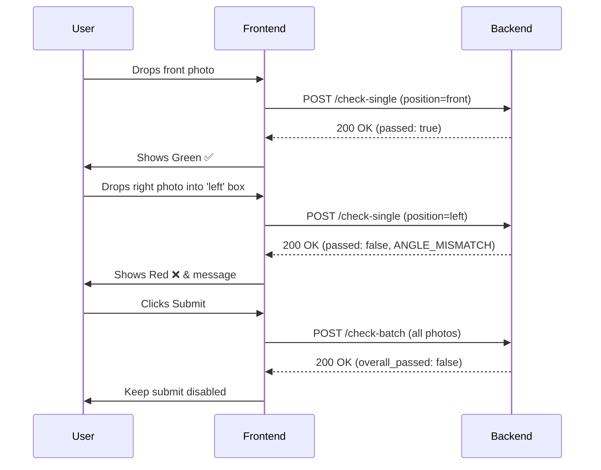

# Photo Verification API - Documentation

## 1. Overview
The Photo Verification API is a FastAPI-based microservice designed for KYC-style onboarding flows. It validates uploaded photos across 5 positions (`full_body`, `front`, `left`, `right`, `back`) to ensure they meet quality and angle constraints without relying on external paid APIs or LLMs.

All Computer Vision logic uses local MediaPipe tasks and OpenCV.

## 2. API Contract

Base path: `/api/v1/photo-verify`

### 2.1 `POST /check-single`
Used for real-time per-box ✅/❌ badge validation.

If a `session_id` is provided and the backend is connected to Redis, this endpoint will also execute a **real-time cross-photo identity check**. If the uploaded photo contains a face that does not match a previously verified face for that `session_id`, it will immediately reject the photo.

**Request** (`multipart/form-data`):
- `file` (File): Image bytes (JPG, PNG, WEBP). Max 10MB.
- `position` (String): One of `full_body`, `front`, `left`, `right`, `back`.
- `session_id` (String, optional): Client generated ID.

**Response (200 OK)**:
```json
{
  "position": "left",
  "passed": false,
  "confidence": 0.932,
  "primary_reason": {
    "code": "ANGLE_MISMATCH",
    "message": "This looks like a Right View photo, but it was uploaded to the Left View box. Please upload a photo turned to your left."
  },
  "checks": {
    "person_and_face": { "passed": true, "score": 1.0 },
    "angle_match": { "passed": false, "score": -45.2, "details": {"detected_angle": "right", "expected_angle": "left"} },
    "blur": { "passed": true, "score": 342.5 },
    "face_centered": { "passed": true, "score": 0.98 },
    "eyes_open": { "passed": true, "score": 0.92 },
    "eyewear": { "passed": true, "score": 0.99 },
    "lighting": { "passed": true, "score": 0.88 },
    "heavy_editing": { "passed": true, "score": 0.80 },
    "face_coverage": { "passed": true, "score": 0.94 }
  },
  "processed_in_ms": 184
}
```

### 2.2 `POST /check-batch`
Used when the user submits the entire form. Processes images in parallel.

**Request** (`multipart/form-data`):
- `full_body`, `front`, `left`, `right`, `back` (Files, all optional).
- `session_id` (String, optional).

**Response (200 OK)**:
```json
{
  "session_id": "abc123",
  "overall_passed": false,
  "identity_consistency": {
    "passed": false,
    "face_similarity_pairs": {
      "front_left": 0.12,
      "front_right": 0.75
    },
    "clothing_consistency_score": 0.82,
    "reason_code": "IDENTITY_MISMATCH_ACROSS_PHOTOS",
    "message": "The face in your Front View photo doesn't match your Right View photo."
  },
  "results": {
    "front": { "position": "front", "passed": true, "checks": {...} },
    "full_body": { "status": "MISSING", "message": "Full body image was not provided." }
  },
  "processed_in_ms": 410
}
```

## 3. Sequence Diagram



## 4. Reason Codes Reference
| Code | Message Example |
|---|---|
| `FILE_TOO_LARGE` | File exceeds maximum size of 10.0MB. |
| `UNSUPPORTED_FORMAT` | Unsupported file format. Please upload JPG, PNG, or WEBP. |
| `CORRUPT_IMAGE` | The image file appears to be corrupted or unreadable. |
| `RESOLUTION_TOO_LOW` | Image resolution too low. Minimum required is 480x480. |
| `NO_FACE_DETECTED` | No face detected in the photo. Please ensure your face is clearly visible. |
| `GROUP_PHOTO_DETECTED` | Only one person should be in the frame. Please upload a solo photo. |
| `NOT_FULL_BODY` | Could not detect a person's pose. Please ensure your full body is in the frame. |
| `BACK_VIEW_NOT_DETECTED` | Could not detect a person from the back. Ensure your head and shoulders are visible. |
| `ANGLE_MISMATCH` | This looks like a Right View photo... |
| `PARTIAL_TURN` | Please turn your head further to the side for the Left View. |
| `IMAGE_BLURRY` | Photo appears blurry or low resolution. |
| `POOR_LIGHTING` | Photo is too dark / washed out. |
| `FACE_NOT_CENTERED` | Face is too far off-center. |
| `EYEWEAR_DETECTED` | Please remove sunglasses/eyeglasses. |
| `EYES_CLOSED` | Eyes appear closed. |
| `FACE_PARTIALLY_COVERED` | Face partially covered. |
| `HEAVY_EDITING_DETECTED`| Image appears heavily edited. |
| `IDENTITY_MISMATCH_ACROSS_PHOTOS`| The face in your Front View photo doesn't match your Left View photo. |

## 5. Security & Privacy
- **Strictly In-Memory (No Disk Persistence)**: Raw image bytes and facial landmarks are kept purely in memory and are never logged to disk, ensuring compliance with strict biometric handling standards.
- **Biometric Caching (Redis)**: If real-time identity verification is enabled, facial embeddings (128-d float arrays) are temporarily stored in Redis under the `session_id`. These records are strictly governed by an automatic Time-To-Live (TTL) expiry of 1 hour (`IDENTITY_SESSION_TTL_SECONDS`). Once the TTL expires, the biometric session data is permanently deleted.
- **Request Timeouts**: All verification requests are guarded by explicit `asyncio.wait_for` timeouts (default 8s) to prevent any pathological image from hanging a worker process.
- **Rate Limiting**: Currently unauthenticated. Rate limiting and authentication should be enforced at the API Gateway or Ingress controller level.

## 6. Environment Variables
- `APP_NAME`: Name of the API (default: Photo Verification API).
- `WORKER_POOL_SIZE`: Number of process pool workers. Determines concurrency (default: 4).
- `BATCH_TIMEOUT_SECONDS`: Maximum processing time allowed per request before enforcing a 504 Timeout (default: 8).
- `REDIS_URL`: Connection string for Redis cache (e.g. `redis://localhost:6379/0`).
- `IDENTITY_SESSION_TTL_SECONDS`: How long identity embeddings live in Redis before expiring (default: 3600 seconds / 1 hour).

## 6. Known Limitations
- **Eyewear & Editing Heuristics**: The `check_eyewear` (contrast-based) and `check_heavy_editing` (ELA variance) checks are pure heuristics to remain 100% LLM/Cloud-free. They will have a higher error rate than trained classifiers.
- **Upgrades**: If the false-positive rate is too high, swap these specific checks with a tiny ONNX classifier via `onnxruntime`.
- **Yaw Angle Calibration**: MediaPipe gives relative angles. Testing is required to map threshold boundaries (15°, 25°) precisely for diverse subjects.

## 7. Scaling Notes
Currently, inference is orchestrated via Python's `ProcessPoolExecutor`.
To scale out horizontally (e.g., Kubernetes, multiple nodes), the `verify_image` pipeline in `app.verification.pipeline` is framework-agnostic. 
You can replace the local ProcessPoolExecutor with `Celery` + `Redis` by defining a `@celery.task` that calls `verify_image` without changing the CV logic.
